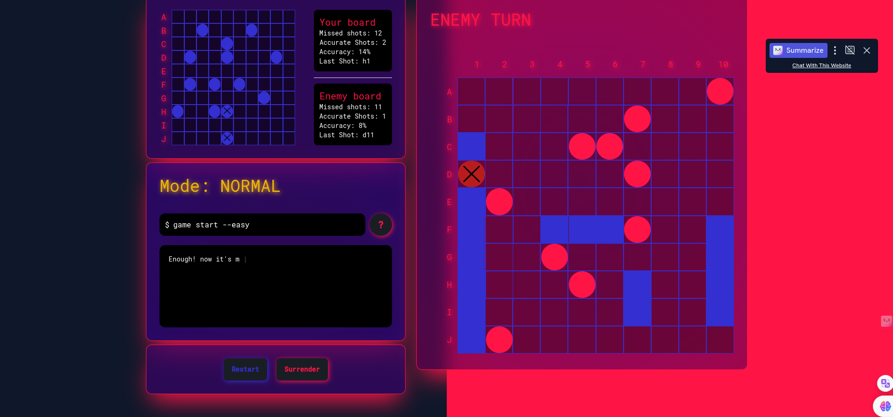
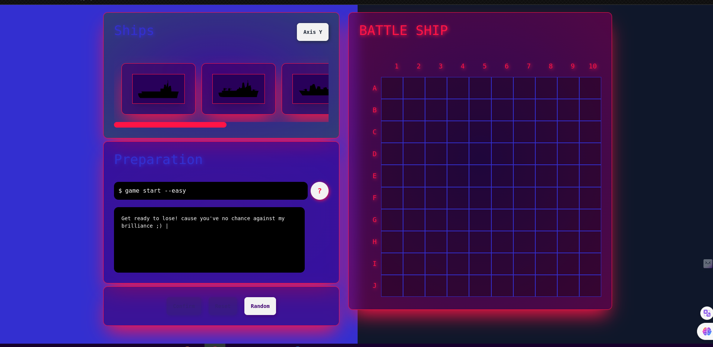
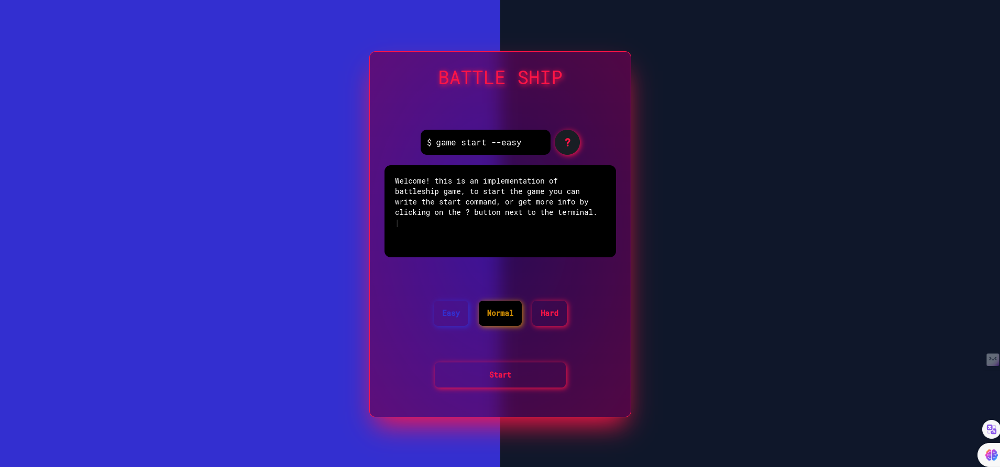

# Country query

demo: [https://battleship-rc.netlify.app/](https://battleship-rc.netlify.app/)

Hey there this is me AZKA 🙋‍♂️

and this is React Battle ship, A beautiful implementaion of classic battle ship game, with some innovations :), You can start by positioning your ships and getting ready for an epic battle with computer.

✏️ How to use it:

Desktop:

- First choose a difficulty mode and then hit start (or alternativly you can run the start command) 
- Start positioning yuor ships on the board by clicking on the ships and placing them on the board, or you can hit on random button to position them randomly
- Click on start button 
- Win the game by destroying all the enemeies ships
- You can surrender - restart - change the difficulty via terminal and ...

🔴 Things i learned:

1- Having some great hands on experience with context api and improving my understanding of complex ui state
2- Using Type script
3- First experience with RTL (react testing library)

🤔 further improvements:

- Increasing test coverage
- Writing more comments
- Cleaning up complex components such as grid
- Using redux instead of context api would be more appropriate due to the complex ui logic of this application
